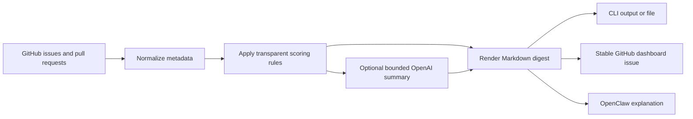

# Maintainer Radar

[](https://github.com/gowthamram/maintainer-radar/actions/workflows/ci.yml)
[](https://www.python.org/)
[](LICENSE)

**A transparent maintenance queue for GitHub repositories.**

Maintainer Radar turns open issues and pull requests into one prioritized
Markdown digest. It highlights failing checks, requested changes, waiting
reviews, release-ready pull requests, stale work, and missing owners without
automatically changing repository state.

It runs as a local CLI, a scheduled GitHub Action, or an OpenClaw skill.
Deterministic scoring works with no AI provider. An optional OpenAI summary can
brief maintainers on the same normalized findings.

## What It Produces

```text
Queue health
  Open issues ................ 2
  Open pull requests ......... 3
  Act-now items .............. 2
  Ready-to-land PRs .......... 1

Act now
  80  #127 Harden archive extraction paths
      Failing checks + changes requested + security label

  35  #104 OAuth callback fails when state contains Unicode
      Stale + unassigned + regression label

Ready to land
  30  #131 Add arm64 release artifacts
      Approved + checks passing + release-blocker label
```

See the complete generated [demo report](examples/demo-report.md).

## Why Maintainer Radar

Repository queues contain several different kinds of urgency:

- a pull request with failing checks needs a different response from one simply
  waiting for review
- an approved release pull request should not disappear below recently updated
  issues
- stale and unassigned work needs a visible ownership decision
- opaque AI prioritization is difficult to audit and easy to distrust

Maintainer Radar keeps the ranking deterministic and prints every reason beside
the item. AI is optional and advisory; the rule-based report remains the source
of truth.

## Quick Start

Requirements: Python 3.11 or newer.

Install from a local checkout:

```bash
git clone https://github.com/gowthamram/maintainer-radar.git
cd maintainer-radar
python -m pip install .
```

Run the included demo without credentials:

```bash
maintainer-radar scan \
  --fixture examples/demo-repository.json \
  --output maintainer-radar-report.md
```

Scan a live repository:

```bash
export GITHUB_TOKEN="$(gh auth token)"
maintainer-radar scan --repo owner/repository
```

The token is read from the environment and is never included in the report.

## GitHub Action

Create `.github/workflows/maintainer-radar.yml`:

```yaml
name: Maintainer Radar

on:
  workflow_dispatch:
  schedule:
    - cron: "17 8 * * 1"

permissions:
  contents: read
  pull-requests: read
  checks: read
  issues: write

jobs:
  digest:
    runs-on: ubuntu-latest
    steps:
      - uses: gowthamram/maintainer-radar@v1
        with:
          github-token: ${{ secrets.GITHUB_TOKEN }}
          publish: "true"
```

`publish: "true"` creates one issue containing the marker
`<!-- maintainer-radar-dashboard -->`. Later runs update that issue instead of
creating notification noise.

For report-only operation, omit `publish`; the Action writes
`maintainer-radar-report.md` and exposes its path as `report-path`.

### Action Inputs

| Input | Default | Purpose |
| --- | --- | --- |
| `repository` | current repository | Repository in `owner/name` form |
| `publish` | `false` | Create or update the dashboard issue |
| `stale-days` | `30` | Inactivity threshold |
| `review-wait-days` | `7` | Pull request review threshold |
| `max-items` | `10` | Findings shown per section |
| `output` | `maintainer-radar-report.md` | Generated report path |
| `dashboard-title` | `Maintainer Radar dashboard` | Issue title |
| `ai-summary` | `false` | Add an advisory OpenAI briefing |
| `openai-model` | `gpt-5-mini` | Model for the optional briefing |

## OpenClaw

The repository includes a
[ClawHub-ready skill](integrations/openclaw/maintainer-radar/SKILL.md). It
teaches OpenClaw to run read-only scans, explain deterministic findings, and
keep publishing behind explicit user intent.

Install the CLI, then copy the skill into an OpenClaw workspace:

```bash
mkdir -p ~/.openclaw/workspace/skills
cp -R integrations/openclaw/maintainer-radar \
  ~/.openclaw/workspace/skills/maintainer-radar
openclaw skills list
```

Example prompts:

```text
Scan owner/repository and tell me what needs attention today.
Explain why the top three items received their scores.
Publish the Maintainer Radar dashboard for owner/repository.
```

The final prompt is intentionally write-capable. The skill treats scanning and
publishing as separate operations.

## Optional OpenAI Briefing

The deterministic report does not require an API key. To add a short advisory
summary:

```bash
export OPENAI_API_KEY="..."
maintainer-radar scan \
  --repo owner/repository \
  --ai-summary \
  --openai-model gpt-5-mini
```

Only normalized findings are sent: item number, kind, truncated title, score,
category, score reasons, and suggested action. Source code, issue bodies,
comments, tokens, and repository secrets are not sent. If the request fails,
the deterministic report is still generated.

## Scoring

Scores are additive and intentionally simple:

| Signal | Score |
| --- | ---: |
| Pull request has failing checks | +40 |
| Changes requested | +30 |
| Waiting at least 7 days for review | +25 |
| Approved with passing checks | +20 |
| No activity for at least 30 days | +15 |
| No assignee | +10 |
| `security`, `regression`, or `release-blocker` label | +10 |
| Draft pull request | -30 |

Thresholds are configurable. Ties are ordered by oldest update time, then item
number. A score prioritizes human attention; it never authorizes a merge,
close, label, or assignment.

## CLI Reference

```text
maintainer-radar scan (--repo OWNER/REPO | --fixture PATH)
  [--stale-days N]
  [--review-wait-days N]
  [--max-items N]
  [--output PATH]
  [--publish]
  [--dashboard-title TITLE]
  [--ai-summary]
  [--openai-model MODEL]
```

Examples:

```bash
# Print a report
maintainer-radar scan --repo pallets/flask

# Use different thresholds
maintainer-radar scan \
  --repo owner/repository \
  --stale-days 45 \
  --review-wait-days 5

# Create or update the dashboard issue
maintainer-radar scan --repo owner/repository --publish
```

Exit codes:

- `0`: report generated successfully
- `1`: GitHub, network, file, or publication failure
- `2`: invalid configuration or fixture data

## How It Works



The GitHub client follows API pagination and enriches pull requests with
requested reviewers, review state, and check-run conclusions. Partial fetches
fail rather than publishing an incomplete dashboard.

## Security and Privacy

- Tokens are accepted through environment variables or Action secrets only.
- Error messages do not include token values.
- Repository text is escaped before Markdown rendering.
- Optional AI instructions treat repository metadata as untrusted data.
- The Action requests read permissions by default; `issues: write` is needed
  only for dashboard publication.
- No hosted service or database receives repository data.

See [SECURITY.md](SECURITY.md) for vulnerability reporting.

## Limitations

- GitHub.com is the only supported forge in `0.1.0`.
- Review state is derived from the latest REST review submitted by each user.
- Check runs are limited to the first 100 checks for each pull request.
- The CLI does not merge, close, label, assign, or comment on work items.
- Large repositories may consume significant GitHub API quota because pull
  requests require enrichment calls.

## Development

```bash
git clone https://github.com/gowthamram/maintainer-radar.git
cd maintainer-radar
uv sync --extra dev
uv run pytest
uv run ruff check .
uv run python -m build
```

Generate the checked-in demo report:

```bash
uv run maintainer-radar scan \
  --fixture examples/demo-repository.json \
  --output examples/demo-report.md
```

Read [CONTRIBUTING.md](CONTRIBUTING.md) before opening a pull request.
## Roadmap

- configurable label weights and ignored labels
- GitHub GraphQL batching for large repositories
- trend snapshots for queue health over time
- ClawHub publication and installation flow
- GitLab support after the GitHub workflow is stable

## License

[MIT](LICENSE)
